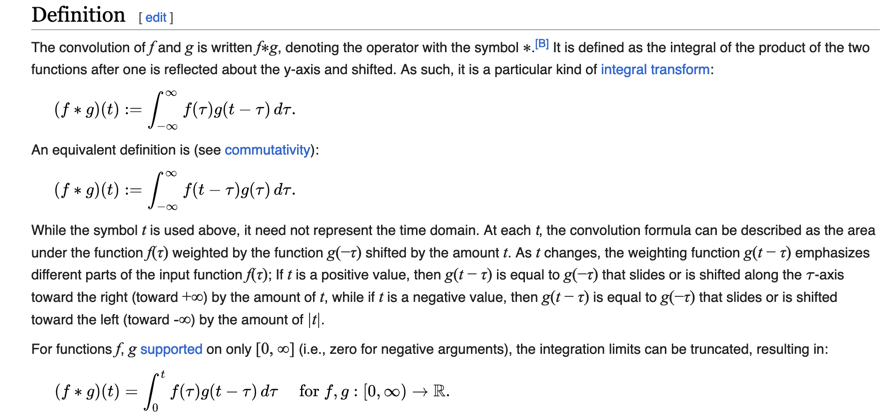

# class 3

## Lecture 3 Image Filtering and Feature Detection

Last time we discussed "wtf an image is!"

## Today!  Image transformation

* Linear Operators
* Statistical Operators
* Convolution

# convolution operator

# Brief intro to ML

$$ \hat{y} = \theta_0 + \theta_1 x $$

Supervised Learning where we have the target values.

What we actually want to have is a learning algorithm, where we get the data, operate on it,
then output the target value.

# Linear Regression / Logistic Regression Stuff

$$ \hat{y} = \theta_0 + \theta_1 x $$

$\theta_0$ is the intercept

$\theta_1$ is the slope

just like ML class

